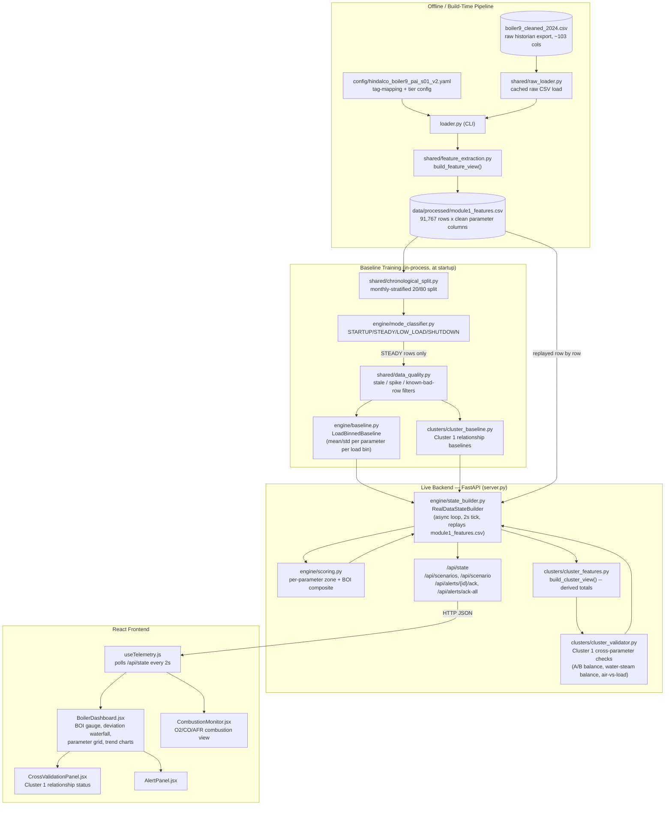

# Boiler Digital Twin — Hindalco Boiler-9 (PAI-S01)

A real-data industrial monitoring platform for a CFBC (Circulating Fluidized Bed Combustion)
boiler. Replays a full year (2024) of real historian telemetry through a FastAPI backend and
scores it against **historically-learned, load-binned baselines** to compute a live Boiler
Operating Index (BOI), operating mode, cross-parameter consistency checks, and alarms — all
displayed on a React control-room dashboard.

Originally scaffolded on Emergent with a simulated-data loop; the backend has since been
rebuilt to replay and score **real plant data** instead, while keeping the exact same API
contract so the frontend needed no changes.

---

## Tech Stack

| Layer | Technology |
|---|---|
| Backend | Python 3.13, **FastAPI**, Uvicorn (ASGI lifespan-managed background task) |
| Data processing | **pandas**, PyYAML |
| Frontend | **React** (react-router-dom for routing), Axios |
| UI components | shadcn/ui component set (Radix-based), Tailwind CSS utility classes |
| Charts / visuals | Custom SVG components (`BOIGauge`, `Sparkline`, `O2Gauge`) |
| Config | YAML tag-mapping configs (per-module, per-cluster) — no hardcoded tag names in code |
| Data store | **No database.** All state is derived in-memory from flat CSV files (see below) |
| Dev tooling | pytest (`pytest.ini` present), CORS middleware for local dev cross-origin calls |

### Database
There is **no database** in this project. All "state" is:
1. Loaded once at startup from two flat files:
   - `data/raw/boiler9_cleaned_2024.csv` — full raw historian export (~103 columns)
   - `data/processed/module1_features.csv` — pre-extracted, clean per-parameter feature table
     (91,767 rows @ 5-minute intervals)
2. Held in memory by a singleton state machine (`RealDataStateBuilder`) that replays rows in
   timestamp order on a 2-second tick, looping back to the start on reaching the end of the year.
3. Served fresh on every `GET /api/state` call — nothing is written back to disk; alerts and
   acknowledgements live only in the running process's memory and reset on restart.

---

## High-Level Architecture



---

## Module Breakdown

### 1. Offline feature extraction (`loader.py`, `shared/`)
- `shared/raw_loader.py` loads the full raw historian CSV **once**, cached per path, and hands
  out copies so downstream consumers never mutate a shared cache.
- `shared/feature_extraction.py`'s `build_feature_view()` is the single config-driven
  extraction engine: given any tag-mapping YAML (Module 1's or a cluster's), it resolves
  `available` / `derived` / `needs_verification` / `synthetic_needed` / `static_config` tiers
  into a clean output table, printing an availability report for every parameter.
- `loader.py` is a thin CLI wrapper: `python loader.py --csv ... --config ... --out
  module1_features.csv`. Both Module 1's dashboard and the Cluster validation code build off
  this same shared extraction logic instead of re-deriving it independently.

### 2. Baseline training (`engine/baseline.py`, `clusters/cluster_baseline.py`)
Both modules share the same **three-stage training-data hygiene** pipeline before computing
any mean/std, entirely in-process at startup (no separate offline training step):
1. **Monthly-stratified 20/80 split** (`shared/chronological_split.py`) — trains on the first
   20% of *each calendar month's own observed span*, not a single early-year block, so the
   learned baseline sees every month's operating conditions (avoids the seasonal-drift bug an
   earlier single-block split produced).
2. **STEADY-only filtering** (`engine/mode_classifier.py`, imported directly) — startup/
   shutdown/transient rows never pollute the learned "normal" band.
3. **Data-quality filtering** (`shared/data_quality.py`) — frozen/stale streaks, statistically
   implausible spikes, and a short manually-curated list of known-bad timestamps.

`engine/baseline.py` bins `UNIT_LOAD` into non-uniform bands (finer resolution 90–111% MCR,
where 97%+ of real data actually lives; coarser below) and serves `mean`/`std` per parameter
per bin, falling back to the global mean/std when a bin is too sparse to trust.

### 3. Scoring engine (`engine/scoring.py`)
Pure math, no I/O — given an actual + expected value it returns a `zone` (green/amber/red),
`deviation_pct`, and a 0–100 `sub_score`. Two zoning methods:
- **%-deviation** against fixed amber/red thresholds (7 of 10 parameters)
- **Z-score against the baseline's std** for `drum_level`, `furnace_draft`, `o2` — chosen
  because their expected values are small or sign-changing, so a fixed %-band is unstable.

The composite **BOI** is a weighted average of valid sub-scores (safety-critical parameters
weighted higher), with any single sub-score < 50 forcing that parameter's zone to red
regardless of the overall BOI, and a `data_quality_pct` / `safety_data_incomplete` flag if too
much safety-critical data is missing.

### 4. Mode classifier (`engine/mode_classifier.py`)
Rule-based classifier (STARTUP / STEADY / LOW_LOAD / SHUTDOWN) off rolling slopes of
`MAIN_STEAM_PRESSURE`, `MAIN_STEAM_TEMPERATURE`, `BED_TEMP_AVG`, and `UNIT_LOAD`. Includes
absolute-level gates (not just rate-of-change) added after real-data testing showed slope-only
rules were mislabeling ordinary high-load disturbances as SHUTDOWN/STARTUP. Ships
`MODE_VALIDATION_NOTES` so a reviewer understands *why* SHUTDOWN legitimately never fires on
this dataset (the plant never actually shuts down in the 2024 CSV).

### 5. Cluster 1 — Load-Flow Mass Balance (`clusters/`)
A second, independent validation layer that checks **relationships between parameters**
(Steam Flow-A vs B, Feedwater vs Total Steam Flow, Total Combustion Air vs Load, SA/TA side
balances) rather than one parameter's deviation from its own baseline — deliberately not
folded into the BOI score, to avoid double-counting the same underlying issue.
- `cluster_features.py` — derives the combined totals (Total Main Steam Flow, Total
  Combustion Air, etc.) off the same shared raw load.
- `cluster_baseline.py` — same 3-stage training hygiene as Module 1's baseline.
- `cluster_validator.py` — scores each relationship `consistent` / `outlier` / `ambiguous` /
  `unknown` per row, implementing two explicit tiebreakers (trust whichever candidate value
  lands closer to what the baseline/Load predicts; mark `ambiguous` rather than guess when it's
  too close to call).

### 6. Live backend orchestration (`engine/state_builder.py`, `server.py`)
`RealDataStateBuilder` is the async singleton that ties everything together: replays
`module1_features.csv` one row per 2-second tick, resolves each parameter's baseline
expectation, scores it, classifies the mode, runs the Cluster 1 cross-validation, manages
alert lifecycle (fire / auto-clear / acknowledge), and assembles the full `/api/state` JSON
snapshot. `server.py` is the thin FastAPI app exposing that snapshot plus scenario and
alert-acknowledgement endpoints, with a lifespan hook that starts/stops the builder's
background loop. `simulation.py` (the old fake-data engine) is intentionally left in the repo,
unimported, as a reference/fallback.

### 7. Frontend (`src/`)
- `App.js` — react-router routes: `Landing` → `ModuleSelect` → per-module dashboards
  (`/modules/pai-s01` → `BoilerDashboard`, `/modules/pai-s03` → `CombustionMonitor`), wrapped
  in a shared `Layout`.
- `hooks/useTelemetry.js` — polls `GET /api/state` every 2s, keeping last-known state during
  transient failures so the UI doesn't flicker.
- `pages/BoilerDashboard.jsx` — BOI gauge, deviation waterfall, live parameter grid, trend
  sparklines, alarm log, and the Cluster 1 cross-validation panel.
- `pages/CombustionMonitor.jsx` — O2/CO/AFR combustion-specific view.
- `components/` — presentational pieces (`BOIGauge`, `O2Gauge`, `Sparkline`, `AlertPanel`,
  `CrossValidationPanel`, `StatusChips`) plus a full shadcn/ui component library under
  `components/ui/`.
- `lib/api.js` — thin Axios wrapper around the FastAPI endpoints; `lib/format.js` — shared
  number/status formatting used across the dashboard.

---

## Data Flow Summary

1. **Offline, once:** raw historian CSV + tag-mapping YAML → `loader.py` → clean
   `module1_features.csv`.
2. **At backend startup:** that CSV is split (monthly-stratified), filtered to STEADY/
   clean rows, and used to train both the per-parameter load-binned baseline and the Cluster 1
   relationship baseline.
3. **Every 2 seconds, live:** the next row of `module1_features.csv` is replayed → scored
   against its baseline (zone/sub-score/BOI) → mode-classified → cross-validated against
   Cluster 1 relationships → assembled into one JSON snapshot → served at `GET /api/state`.
4. **Frontend:** polls that same endpoint every 2 seconds and renders it across the dashboard,
   combustion monitor, and cross-validation panel — with zero knowledge that the data is real
   historian replay rather than a live plant connection.

---

## Known Open Items (flagged in code, not silently resolved)
- `DRUM_LEVEL` is `needs_verification` — candidate tags may be control-valve position feedback,
  not a true level signal. Marked `"data_source": "unverified"` throughout, never treated as
  ground truth.
- `FEGT` and `STACK_TEMPERATURE` currently map to the same raw historian tag — possible spec
  duplication, flagged, not yet resolved.
- No reheat cycle, no separate FD fan, no soot blower on this unit — those parameters/states
  are intentionally excluded rather than stubbed.
- `SHUTDOWN` mode fires ~0 times on the full 2024 dataset by design — the plant genuinely never
  shuts down in this data; thresholds remain unvalidated against a real shutdown event pending
  plant-engineer review (see `MODE_VALIDATION_NOTES`).

## Repository Layout
```
backend/
├── config/hindalco_boiler9_pai_s01_v2.yaml   # Module 1 tag-mapping + tier config
├── data/
│   ├── raw/boiler9_cleaned_2024.csv          # full raw historian export (gitignored — large)
│   └── processed/module1_features.csv        # extracted feature table
├── shared/                                    # raw load, feature extraction, split, data-quality
├── engine/                                    # baseline, scoring, mode classifier, state builder
├── clusters/                                  # Cluster 1 cross-parameter validation
├── loader.py                                  # offline CLI: raw CSV -> feature CSV
├── server.py                                  # FastAPI app
└── simulation.py                              # legacy fake-data engine (kept, unused)
frontend/
└── src/
    ├── pages/                                 # Landing, ModuleSelect, BoilerDashboard, CombustionMonitor
    ├── components/                            # gauges, panels, chips, shadcn/ui library
    ├── hooks/useTelemetry.js                   # polls backend state
    └── lib/                                    # api.js, format.js
```
